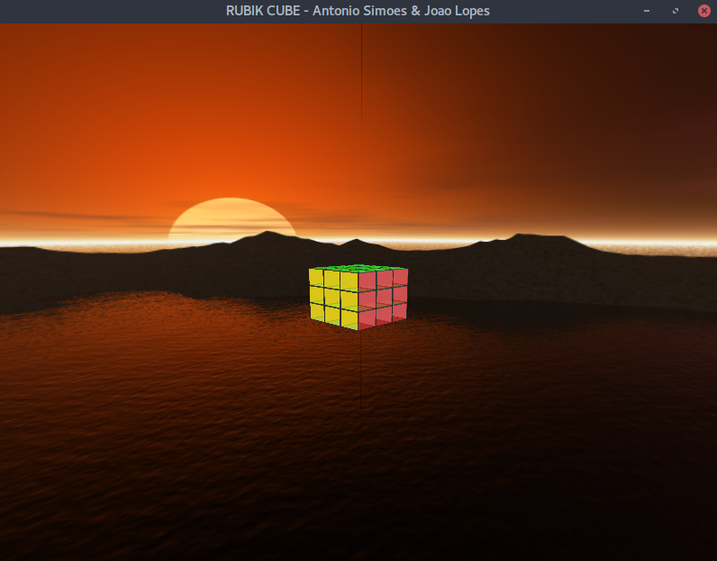

# rubik-opengl

Computer Graphics assignment being Rubik's cube the theme.

Authors: [António Simões](https://github.com/amsimoes) & [João Lopes](https://github.com/jllopes)

# Features

* Rotations, Scale and Translations
* Reflection
* Skybox
* Particles

<p align="center">

</p>

# Running (Linux & MacOS)

```
$ cd src
$ make
$ ./rubik
```

# Instructions

* **Arrows:** Move viewport angle
* **W / S:** Move Front / Back
* **P:** Show / Hide Walls
* **\+ / \-:** Increase / Decrease cube size
* **E:** Secret key
* **T / R:** Increase / Decrease cube transparency
* **B:** Show mirror reflection
